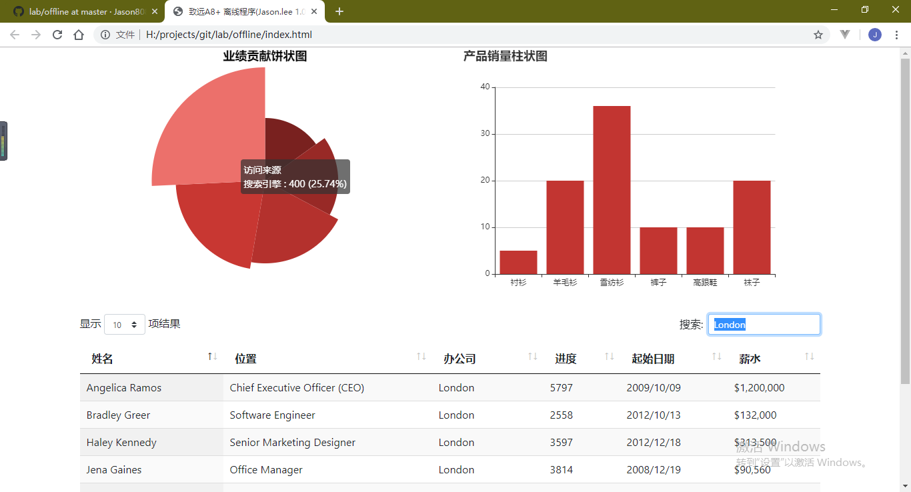

## 致远A8+ 离线程序开发说明书

### 一、启动
- 双击根路径中的 `index.html` 文件 (无需部署服务)

### 二、说明

#### 2.1 组件
##### 2.1.1 eCharts
    ECharts 是一个使用 JavaScript 实现的开源可视化库，涵盖各行业图表，满足各种需求。
    
    ECharts 遵循 Apache-2.0 开源协议，免费商用。
    
    ECharts 兼容当前绝大部分浏览器（IE8/9/10/11，Chrome，Firefox，Safari等）及兼容多种设备，可随时随地任性展示。

##### 2.1.2 dataTables
    Datatables是一款jquery表格插件。它是一个高度灵活的工具，可以将任何HTML表格添加高级的交互功能。
    
    分页，即时搜索和排序
    几乎支持任何数据源：DOM， javascript， Ajax 和 服务器处理
    支持不同主题 DataTables, jQuery UI, Bootstrap, Foundation
    各式各样的扩展: Editor, TableTools, FixedColumns ……
    丰富多样的option和强大的API
    支持国际化
    超过2900+个单元测试
    免费开源 （ MIT license ）！ 商业支持
    更多特性请到官网查看

#### 2.2 开发
##### 2.2.1 环境要求

- 无 

##### 2.2.2 数据生成

- 生成`myJs/data/*.js`中相应的数据文件即可得到相应的页面内容

##### 2.2.3 持续开发

- 目前实现的功能

    1. 饼图和柱状图展示
    2. 图标单击触发事件
    3. 列表功能展示
    4. 表格搜索和排序功能
    5. 行单击触发事件
    
- 需要持续的功能
  
    1. 实现致远插件开发完成数据导出 
        (生成js文件覆盖`myJs/data/*.js`)
    2. 实现单击跳转新列表 
      
        - 跳转新页面
        - 控制当前表格数据展示
        

#### 2.3 复用

1. 可将该模板保存至致远系统
2. 在致远插件"导出离线程序"运行时将模板和数据打包给客户
3. 解压即可使用

### 三、附言

- 无

### 四、讨论

- ＱＱ：569284276
- 微信: 同上
- Mail: 569284276@qq.com
- Blog: [gmlee.cn](http://gmlee.cn/)
- Ｑ群: [８０８０实验室](https://jq.qq.com/?_wv=1027&k=5vD1Zh6"537950351")